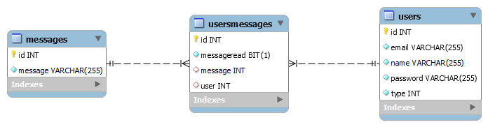

# Documentação de Projeto

Este documento fornece informações sobre a API de Desenvolvimento de Projeto 2, um sistema desenvolvido para facilitar a entrega e confirmação de mensagens enviadas pelo NAI.

## Requisitos

Antes de instalar o software, verifique se o seu sistema atende aos seguintes requisitos:

```
Dependências:
    > Java JDK-23
    > MySql
    > Maven
    > WildFly
```

## Instalação

Realizando a Instalação

```
> Inicie o seu terminal
> Vá para a pasta onde o arquivo está localizado
> Após chegar na pasta rode o seguinte comando: mvn clean package
> Realize o deploy no WildFly do .war que está localizado na pasta ./target/projeto2-<Versão>.war

```

## Documentação da API

#### Diagrama do banco



#### Endpoints

Todas as requisições são realizadas por meio de protocolos *HTTP* definidos nos controllers:

* /api/auth/login - Caminho para requisições de login de usuários;
* /api/user - Caminho para requisições utilizadas no CRUD de usuários;
* /api/message - Caminho para requisições utilizadas no CRUD de documentos;
* /api/usermessage - Caminho para requisições utilizadas no CRUD de vinculação de mensagens a usuários;

## Uso/Exemplos

#### Login

```http
> POST /api/auth/login
```

| Requisição | Onde | Parâmetro              | Tipo               | Descrição                               | Retorno                        | Tipo                   |
| :----------: | :--: | ----------------------- | ------------------ | ----------------------------------------- | ------------------------------ | ---------------------- |
|     POST     | Body | `{ email, password }` | `String, String` | **Obrigatório** Email e Password. | `{ token, expiresIn, user }` | `String, Long, User` |

#### Usuário

```http
> GET /api/user
> GET /api/user/${login}
> POST /api/user
> PUT /api/user/${id}
> DELETE /api/user/${id}
```

| Requisição |   Onde   | Parâmetro                                   | Tipo                                         | Descrição                                                 | **Retorno**                   | Tipo                                 |
| :----------: | :-------: | -------------------------------------------- | -------------------------------------------- | ----------------------------------------------------------- | ----------------------------------- | ------------------------------------ |
|     GET     |          |                                              |                                              |                                                             | `List<{ id, name, email, type }>` | `Integer, String, String, Integer` |
|     GET     |    URL    | `email`                                    | `String`                                   | **Obrigatório.** O Email do usuário que você quer | `{ id, name, email, type }`       | `Integer, String, String, Integer` |
|     POST     |   Body   | `{ name, email, password, type }`          | `String, String, String, Integer`          | **Obrigatório** Name, Email, Password e Type.      | `{ id, name, email, type }`       | `Integer, String, String, Integer` |
|     PUT     | URL, Body | `id`, `{ name, email, password, type }` | `Integer, String, String, String, Integer` | **Obrigatório** Id, Name, Email, Password, e Type.  | `{ id, name, email, type }`       | `Integer, String, String, Integer` |
|    DELETE    |    URL    | `id`                                       | `Integer`                                  | **Obrigatório.** O Id do usuário que você quer    | `null`                            |                                      |

#### Documentos

```http
> GET /api/message
> GET /api/message/${id}
> POST /api/message
> PUT /api/message/${id}
> DELETE /api/message/${id}
```

| Requisição |   Onde   | Parâmetro        | Tipo                            | Descrição                                              | Retorno                | Tipo                |
| :----------: | :-------: | ----------------- | ------------------------------- | -------------------------------------------------------- | ---------------------- | ------------------- |
|     GET     |          |                   |                                 |                                                          | `List<{ id, file }>` | `Integer, String` |
|     GET     |    URL    | `id`            | `Integer`                     | **Obrigatório**. O Id do documento que você quer | `{ id, file }`       | `Integer, String` |
|     POST     |   Body   | `file`          | `MultipartFile`               | **Obrigatório** File.                            | `{ id, file }`       | `Integer, String` |
|     PUT     | URL, Body | `id`, `file` | `Integer`, `MultipartFile` | **Obrigatório** Id e File.                       | `{ id, file }`       | `Integer, String` |
|    DELETE    |    URL    | `id`            | `Integer`                     | **Obrigatório**. O Id do documento que você quer | `null`               |                     |

#### Mensagens Usuários

```http
> GET /api/usermessage
> GET /api/usermessage/${id}
> POST /api/usermessage
> PUT /api/usermessage/${id}
> DELETE /api/usermessage/${id}
```

| Requisição |   Onde   | Parâmetro                           | Tipo                       | Descrição                                                                       | Retorno                               | Tipo                                |
| :----------: | :-------: | ------------------------------------ | -------------------------- | --------------------------------------------------------------------------------- | ------------------------------------- | ----------------------------------- |
|     GET     |          |                                      |                            |                                                                                   | `List<{ id, user, message, read }>` | `Integer, User, Message, Boolean` |
|     GET     |    URL    | `user`                             | `Integer`                | **Obrigatório**. O Id do Usuário que você quer                           | `{ id, user, message, read }`       | `Integer, User, Message, Boolean` |
|     POST     |   Body   | `{ user, message, read }`          | `User, Message, Boolean` | **Obrigatório** User e Message e Read.                                    | `{ id, user, message, read }`       | `Integer, User, Message, Boolean` |
|     PUT     | URL, Body | `id`, `{ user, message, read }` | `User, Message, Boolean` | **Obrigatório** Id, User e Message e Read.                                | `{ id, user, message, read }`       | `Integer, User, Message, Boolean` |
|    DELETE    |    URL    | `id`                               | `Integer`                | **Obrigatório**. O Id do vínculo entre mensagem e usuário que você quer | `null`                              |                                     |

## Solução de problemas

Ao realizar a compilação do software são gerados erros de Compilação: cannot find symbol. Esses erros estão sendo causados pela utilização das anotações da biblioteca Lombok, necessário esperar uma atualização do Spring Boot que venha a solucionar o problema, por hora a solução é gerar todos os construtores, getters e setters de forma manual.

## Autores

- [@Marcos Gomes](https://github.com/marcos221-Br) - BackEnd
- [@Lucas Delfrate](https://github.com/LucasDelfrate) - FrontEnd
